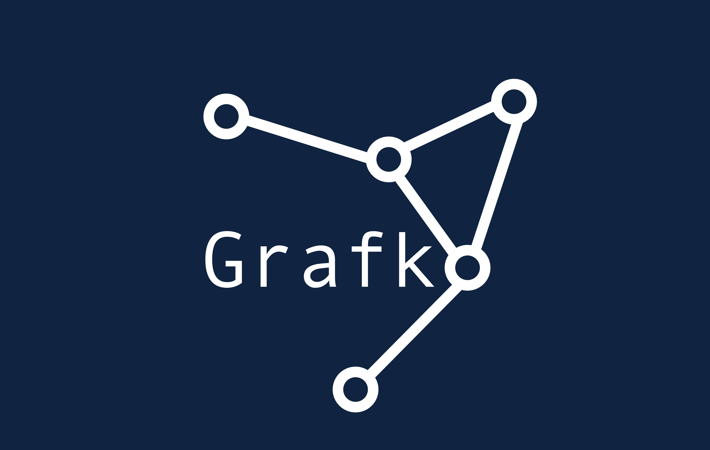

# Grafko

A Python framework for training molecular graph neural networks for classification and regression tasks on chemical structures.


 

## Overview

Grafko is a comprehensive Python framework designed for creating, training, and evaluating graph neural networks (GNNs) specifically tailored for molecular property prediction. Built on PyTorch and PyTorch Geometric, Grafko provides an accessible and versatile API for chemical machine learning tasks, supporting both classification and regression problems.

## Key Features

- **Easy-to-use CLI and API** for training molecular GNNs without extensive coding
- **Multiple GNN architectures** including GCN, GAT, and GraphConv
- **Built-in class balancing** using weighted sampling for imbalanced datasets
- **Hyperparameter optimization** via Optuna integration
- **Comprehensive evaluation metrics** including ROC curves, confusion matrices, and regression metrics
- **Support for various molecular datasets** through CSV and Excel files with SMILES strings
- **Early stopping and learning rate scheduling** for optimal training
- **Visualization tools** for model performance analysis

## Installation

### Prerequisites

- Python 3.8 or higher
- PyTorch 1.9 or higher
- PyTorch Geometric (PyG) compatible with your PyTorch version

### Install from Source

```bash
# Clone the repository
git clone https://github.com/user/grafko.git
cd grafko

# Install the package in development mode
pip install -e .
```

### Using micromamba/conda

```bash
# Create and activate a new environment
micromamba create -n grafko python=3.8
micromamba activate grafko

# Install PyTorch and PyTorch Geometric
micromamba install pytorch pytorch-geometric -c pytorch -c pyg

# Install the package
pip install -e .
```

## Quick Start

### Command Line Interface

Train a GNN model on a dataset with SMILES strings:

```bash
grafko_run --data_file your_molecules.csv \
           --smiles_col smiles \
           --target_col activity \
           --task_type classification \
           --num_classes 2 \
           --output_dir results
```

For regression tasks:

```bash
grafko_run --data_file your_properties.csv \
           --smiles_col smiles \
           --target_col property_value \
           --task_type regression \
           --output_dir results
```

### Python API

```python
from grafko.data import MolecularDatasetFactory
from grafko.models import MolecularGNNFactory
from grafko.training import ModelTrainer, get_weighted_sampler
from torch_geometric.data import DataLoader
import torch

# Load dataset
dataset = MolecularDatasetFactory.from_csv('your_data.csv', 
                                          smiles_col='smiles', 
                                          target_col='activity')

# Create train/test split
train_size = int(0.8 * len(dataset))
test_size = len(dataset) - train_size
train_dataset, test_dataset = torch.utils.data.random_split(dataset, [train_size, test_size])

# Handle imbalanced data
sampler = get_weighted_sampler(train_dataset, num_classes=2)
train_loader = DataLoader(train_dataset, batch_size=32, sampler=sampler)
test_loader = DataLoader(test_dataset, batch_size=32)

# Create model
model = MolecularGNNFactory.create_model(
    model_type='basic_gnn',
    config={
        'in_channels': dataset.num_node_features,
        'hidden_channels': 64,
        'out_channels': 2, # binary classification
        'num_layers': 3,
        'dropout_rate': 0.2,
        'layer_type': 'GCN',
        'activation': 'relu',
        'pooling': 'mean',
        'task_type': 'classification'
    }
)

# Create trainer and train model
device = torch.device('cuda' if torch.cuda.is_available() else 'cpu')
trainer = ModelTrainer(model, device=device, task_type='classification')
history = trainer.train(train_loader, test_loader, epochs=100, patience=10)

# Evaluate and save model
metrics = trainer.evaluate(test_loader)
trainer.save_model('my_model.pt')
```

## CLI Options

### Dataset Arguments

- `--data_file`: Path to CSV or Excel file with molecules
- `--smiles_col`: Name of column containing SMILES strings
- `--target_col`: Name of column containing target values
- `--task_type`: 'classification' or 'regression'
- `--num_classes`: Number of classes for classification tasks
- `--test_size`: Fraction of dataset to use for testing
- `--val_size`: Fraction of training data to use for validation
- `--imbalance_threshold`: Ratio threshold to consider dataset imbalanced

### Training Arguments

- `--batch_size`: Batch size for training
- `--epochs`: Maximum number of epochs
- `--patience`: Early stopping patience
- `--learning_rate`: Learning rate for optimizer
- `--weight_decay`: Weight decay for regularization

### Model Arguments

- `--hidden_channels`: Hidden layer dimensions
- `--num_layers`: Number of GNN layers
- `--dropout`: Dropout rate
- `--layer_type`: 'GCN', 'GAT', or 'GraphConv'
- `--pooling`: 'mean', 'sum', or 'max'

### Hyperparameter Tuning

- `--tune`: Enable hyperparameter tuning
- `--n_trials`: Number of trials for hyperparameter tuning
- `--timeout`: Timeout for tuning in seconds

### Output Arguments

- `--output_dir`: Directory for saving results
- `--model_name`: Base name for saved model files

## Architecture

Grafko consists of several modules:

- **data**: Handles dataset loading and preprocessing
- **models**: Defines the graph neural network architectures
- **training**: Contains training logic and evaluation metrics
- **utils**: Provides helper functions including hyperparameter tuning

## License

This project is licensed under the MIT License - see the LICENSE file for details.

## Contributing

Contributions are welcome! Please feel free to submit a Pull Request.

## Acknowledgements

- [PyTorch Geometric](https://github.com/pyg-team/pytorch_geometric)
- [RDKit](https://www.rdkit.org/)
- [Optuna](https://optuna.org/)
